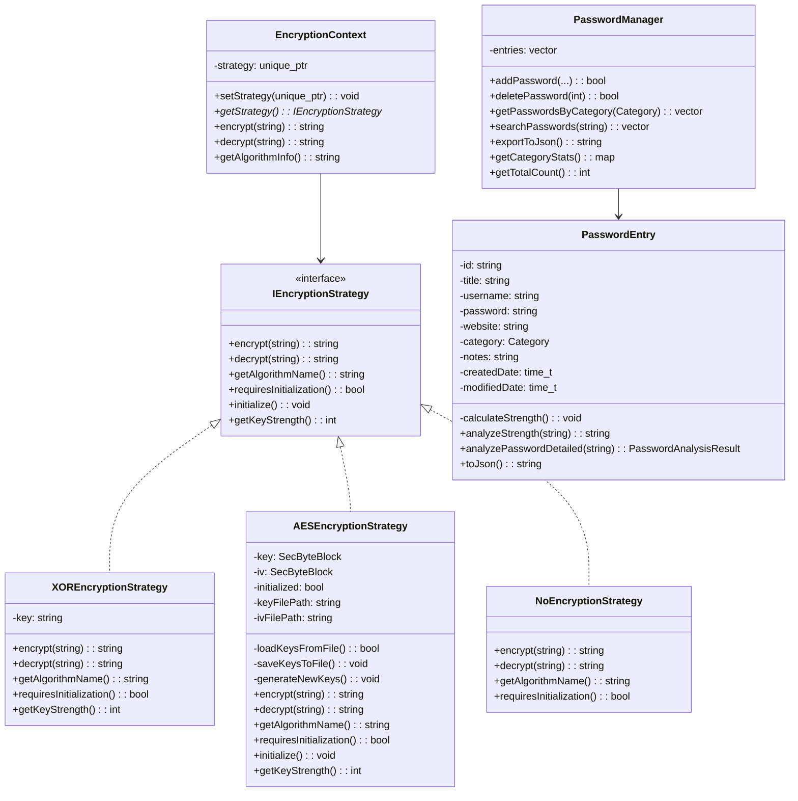

# C++ OOP Architecture and Design Summary

This document explains how C++ OOP principles, patterns, and modules are used in the native layer of this project (Android NDK + Flutter FFI). It’s formatted for an OOP course submission and viva.

## 1) Big Picture

- Build target: a shared library `passwordcore` compiled by CMake.
- Two bridging surfaces:
  - JNI (Android Java/Kotlin ↔ C++): `android/app/src/main/cpp/JNI_Wrapper.cpp`
  - FFI (Flutter Dart ↔ C++): `android/app/src/main/cpp/native_ffi_bridge.cpp`
- Core domain: password entries, password manager, encryption strategies, generators, and analysis.

## 2) Class Diagram (high‑level)

## 3) Where OOP Concepts Are Used (with file paths)

- Abstraction
  - `core/IEncryptionStrategy.h`: Defines the interface for all encryption algorithms.
  - `models/PasswordEntry.h|.cpp`: Hides strength analysis and JSON details.
- Encapsulation
  - `core/AESEncryptionStrategy.h`: Keeps key/IV and key I/O as private details.
  - `models/PasswordEntry.cpp`: Owns password fields and strength computation.
- Inheritance
  - `core/XOREncryptionStrategy.h`, `core/AESEncryptionStrategy.h`, `core/NoEncryptionStrategy.h` implement `IEncryptionStrategy`.
- Polymorphism
  - `core/EncryptionContext.h`: Calls `encrypt/decrypt` via `IEncryptionStrategy*` chosen at runtime.
- Composition (has‑a)
  - `EncryptionContext` holds `unique_ptr<IEncryptionStrategy>`.
  - `PasswordManager` manages a collection of `PasswordEntry`.
- Dependency Injection
  - `EncryptionContext` constructor/`setStrategy(...)` accept any `IEncryptionStrategy`.
- RAII & Resource Management
  - `std::unique_ptr` for strategy lifetime. Key buffers and JNI string lifecycles are scoped and cleaned up.
- SOLID
  - SRP: Each class has one reason to change (model, manager, strategy, bridge).
  - OCP: Add new strategies without modifying clients.
  - LSP: All strategies are interchangeable via the interface.
  - ISP: Small, focused `IEncryptionStrategy`.
  - DIP: High‑level code depends on the abstraction, not concretes.

## 4) Strategy Pattern in Practice

- Interface: `IEncryptionStrategy` (what can be done).
- Implementations: XOR (educational), AES (secure), None (passthrough).
- Context: `EncryptionContext` delegates to the active strategy.
- Benefit: You can switch algorithms at runtime without changing calling code. This is showcased in `test_strategy_pattern.cpp`.

## 5) Password Strength Analysis (logic overview)

- Analyzed attributes: length, character classes (upper/lower/digit/special), distribution (2+ of a type), and weak patterns ("123", "abc", "password").
- Scoring:
  - Length: up to +50 (8/12/16+ tiers)
  - Variety: up to +60 (upper/lower/digit/special)
  - Distribution bonus: up to +20 (2+ of each used type)
- Label thresholds:
  - ≥ 80: Very Strong
  - ≥ 60: Strong
  - ≥ 40: Moderate
  - ≥ 20: Weak
  - < 20: Very Weak
- Suggestions: generated based on what’s missing (length, types, patterns), e.g. “Add numbers”, “Avoid sequential letters”, etc.
- Files:
  - `models/PasswordEntry.cpp` – `analyzePasswordDetailed`, `analyzeStrength`, `calculateStrength`.

## 6) Bridges (Adapter/Facade)

- JNI (`JNI_Wrapper.cpp`)
  - Exposes manager lifecycle, CRUD, search/filter, statistics, password strength analysis, and generators to Android Java/Kotlin.
  - Returns JSON strings for UI consumption.
- FFI (`native_ffi_bridge.cpp` + `lib/services/native_encryption.dart`)
  - Exposes C ABI functions callable from Flutter (currently XOR demo).
  - Can be swapped to AES without changing Dart call sites.

## 7) How to Demonstrate in Viva

- Strategy swap demo: show `test_strategy_pattern.cpp` output with XOR vs None (and AES once linked).
- Strength analysis demo: call the analyzer (via JNI or a small native test) and discuss why it gives a certain score/label.
- Encapsulation: point to AES private key/IV handling and explain why it’s hidden.
- Polymorphism: show `EncryptionContext` using different strategies without code changes in the caller.
- SOLID: explain how you’d add a new algorithm (e.g., ChaCha20) with zero changes to existing clients.

## 8) Next Steps (for production‑grade crypto)

- Switch FFI bridge from XOR to AES (link Crypto++ or OpenSSL):
  - Implement `AESEncryptionStrategy` fully.
  - Replace calls in `native_ffi_bridge.cpp` from XOR to AES.
- Key management:
  - Generate/store key/IV securely (Android Keystore or provided by Flutter Secure Storage).
  - Add key versioning for rotation.
- Data migration:
  - Detect legacy/plain or XOR‑encrypted data, decrypt, re‑encrypt with AES, and write back with `encryptionVersion`.

---

References (by path):
- `android/app/src/main/cpp/core/IEncryptionStrategy.h`
- `android/app/src/main/cpp/core/EncryptionContext.h`
- `android/app/src/main/cpp/core/XOREncryptionStrategy.h|.cpp`
- `android/app/src/main/cpp/core/AESEncryptionStrategy.h`
- `android/app/src/main/cpp/core/NoEncryptionStrategy.h|.cpp`
- `android/app/src/main/cpp/models/PasswordEntry.h|.cpp`
- `android/app/src/main/cpp/core/PasswordManager.h|.cpp`
- `android/app/src/main/cpp/JNI_Wrapper.cpp`
- `android/app/src/main/cpp/native_ffi_bridge.cpp`
- `android/app/src/main/cpp/test_strategy_pattern.cpp`
